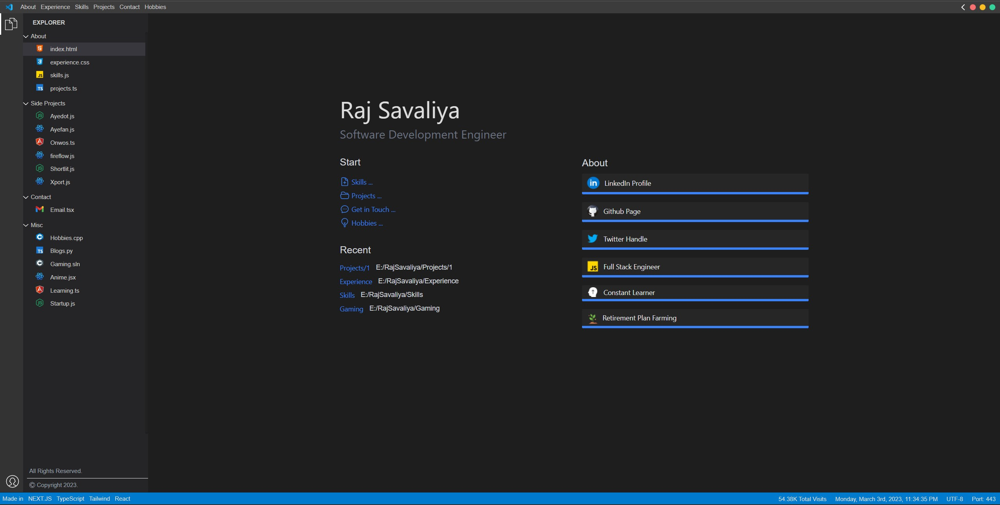

# 🚀 VS Code Theme Portfolio

A stunning, interactive portfolio website built with **Next.js** and **TypeScript**, designed to mimic the **Visual Studio Code** interface. This project showcases a modern, developer-focused portfolio with a unique VS Code theme.



## ✨ Features

### 🎨 **Visual Studio Code Interface**
- **Authentic VS Code UI**: Complete replica of VS Code interface including sidebars, tabs, and status bar
- **Interactive Components**: Functional file explorer, tab management, and window controls
- **Theme Consistency**: Dark theme with VS Code color scheme throughout

### 🌟 **Modern Web Technologies**
- **Next.js 14**: Server-side rendering and static site generation
- **TypeScript**: Type-safe development with full TypeScript support
- **Tailwind CSS**: Utility-first styling for rapid development
- **Framer Motion**: Smooth animations and transitions

### 📧 **Contact Form with Email Integration**
- **Nodemailer Integration**: Functional contact form with Gmail SMTP
- **Email Notifications**: Receive contact form submissions directly to your email
- **Form Validation**: Client and server-side validation
- **Success/Error Handling**: User-friendly feedback system

### 📱 **Responsive Design**
- **Mobile Optimized**: Fully responsive across all device sizes
- **Touch Friendly**: Mobile-specific interactions and gestures
- **Progressive Enhancement**: Works seamlessly on desktop and mobile

### 🚀 **Performance Optimized**
- **Fast Loading**: Optimized images and code splitting
- **SEO Friendly**: Meta tags, sitemap, and structured data
- **Lighthouse Optimized**: High performance, accessibility, and SEO scores

## 🛠️ Tech Stack

### **Frontend**
- **Framework**: Next.js 14.0.4
- **Language**: TypeScript 5.3.3
- **Styling**: Tailwind CSS 3.4.0
- **Animations**: Framer Motion 11.0.0
- **Icons**: Lucide React 0.546.0, Heroicons 2.2.0

### **Backend & Email**
- **API**: Next.js API Routes
- **Email Service**: Nodemailer with Gmail SMTP
- **Authentication**: Environment-based credentials

### **Development Tools**
- **Linting**: ESLint 8.56.0
- **Build Tool**: Next.js built-in bundler
- **Package Manager**: npm
- **Version Control**: Git

## 📥 Installation

### **Prerequisites**
- Node.js (v18 or higher)
- npm or yarn
- Gmail account (for email functionality)

### **Clone Repository**
```bash
git clone https://github.com/kunal899verma/Protfolio.git
cd Protfolio
```

### **Install Dependencies**
```bash
npm install --legacy-peer-deps
```

### **Environment Setup**
Create a `.env.local` file in the root directory:
```env
MAIL_USER=your-gmail@gmail.com
MAIL_PASS=your-app-password
```

**⚠️ Gmail Setup:**
1. Enable 2-Factor Authentication on your Gmail account
2. Generate an App Password: [Google App Passwords](https://myaccount.google.com/apppasswords)
3. Use the 16-character app password in `MAIL_PASS`

### **Run Development Server**
```bash
npm run dev
```
Open [http://localhost:3000](http://localhost:3000) to view the portfolio.

## 🚀 Usage

### **Development**
```bash
npm run dev      # Start development server
npm run build    # Build for production
npm run start    # Start production server
npm run lint     # Run ESLint
```

### **Email Configuration**
Update the email settings in `pages/api/sendEmail.ts`:
- **Sender**: Configure `from` email address
- **Receiver**: Set `to` email address
- **SMTP Settings**: Modify transporter configuration if needed

### **Customization**
- **Personal Info**: Update `Components/JSON/projectsdata.ts`
- **Resume**: Replace `public/Resume/Kunal_Verma_React_NextJS_Developer.pdf`
- **Images**: Update project images in `public/` directory
- **Colors**: Modify VS Code theme colors in `styles/vscode-theme.css`

## 📁 Project Structure

```
├── Components/
│   ├── AboutMeModal/           # About me popup modal
│   ├── AnimatedCard/           # Reusable animated components
│   ├── CodeEditor/             # VS Code editor replica
│   ├── Common/                 # Shared UI components
│   ├── ErrorBoundary/          # Error handling component
│   ├── Icons/                  # Custom icon components
│   ├── JSON/                   # Project data and configuration
│   ├── Layouts/                # Layout components
│   │   ├── Layout.tsx          # Main layout with VS Code UI
│   │   ├── SeondPanel/         # Secondary sidebar
│   │   └── SideMainPanel/      # Main sidebar navigation
│   ├── Loading/                # Loading components
│   ├── StatusBar/              # VS Code status bar
│   ├── TabBar/                 # Tab management system
│   ├── Typography/             # Text components
│   └── hooks/                  # Custom React hooks
├── pages/
│   ├── api/
│   │   └── sendEmail.ts        # Email API endpoint
│   ├── Projects/               # Project detail pages
│   ├── _app.tsx               # Next.js app component
│   ├── index.tsx              # Home page
│   ├── Email.tsx              # Contact page
│   ├── Experience.tsx         # Experience page
│   ├── Skills.tsx             # Skills page
│   └── 404.tsx                # Custom 404 page
├── public/                     # Static assets
├── styles/                     # CSS and styling
│   ├── globals.css            # Global styles
│   ├── vscode-theme.css       # VS Code theme
│   └── ai-design-system.css   # Design system
├── next.config.js             # Next.js configuration
├── tailwind.config.js         # Tailwind CSS configuration
└── tsconfig.json              # TypeScript configuration
```

## 📧 Email Functionality

The portfolio includes a fully functional contact form with the following features:

### **Backend API** (`pages/api/sendEmail.ts`)
- **Method**: POST requests only
- **Validation**: Required fields validation
- **Error Handling**: Comprehensive error catching and logging
- **Response Format**: JSON with success/error status

### **Frontend Integration** (`pages/Email.tsx`)
- **Form Validation**: Client-side field validation
- **Loading States**: Visual feedback during submission
- **Success/Error Messages**: User-friendly notifications
- **Responsive Design**: Mobile-optimized form layout

### **Email Template**
- **HTML Format**: Styled email template
- **Contact Information**: Name, email, and message
- **Professional Layout**: Clean, readable format

## 🌟 Key Components

### **VS Code Interface**
- **File Explorer**: Interactive sidebar with project navigation
- **Tab System**: Multi-tab interface with close/open functionality
- **Status Bar**: Real-time information display
- **Menu Bar**: VS Code-style menu with hover effects

### **Portfolio Sections**
- **Home**: Introduction and hero section
- **Experience**: Professional work history
- **Skills**: Technical skills and expertise
- **Projects**: Detailed project showcases
- **Contact**: Interactive contact form

### **Responsive Features**
- **Mobile Menu**: Collapsible navigation for mobile devices
- **Touch Interactions**: Mobile-optimized gestures
- **Adaptive Layout**: Content reflow for different screen sizes

## 🚀 Deployment

### **Vercel (Recommended)**
```bash
# Install Vercel CLI
npm i -g vercel

# Deploy
vercel --prod
```

### **Netlify**
```bash
# Build the project
npm run build

# Deploy the .next/out folder to Netlify
```

### **Docker**
```dockerfile
FROM node:18-alpine
WORKDIR /app
COPY package*.json ./
RUN npm install --legacy-peer-deps
COPY . .
RUN npm run build
EXPOSE 3000
CMD ["npm", "start"]
```

## 🎯 Performance Features

- **Image Optimization**: Next.js Image component with lazy loading
- **Code Splitting**: Automatic route-based code splitting
- **SEO Optimization**: Meta tags, Open Graph, and structured data
- **Accessibility**: ARIA labels and keyboard navigation support
- **Fast Refresh**: Hot reloading during development

## 🔧 Configuration

### **Next.js Configuration** (`next.config.js`)
- **Image Domains**: Configured for external image sources
- **Security Headers**: Enhanced security configuration
- **Performance Optimization**: Compression and caching headers

### **Tailwind Configuration** (`tailwind.config.js`)
- **VS Code Colors**: Custom color palette matching VS Code theme
- **Font Configuration**: JetBrains Mono and system fonts
- **Custom Utilities**: VS Code-specific utility classes

## 🤝 Contributing

1. **Fork the Repository**
2. **Create Feature Branch**: `git checkout -b feature/amazing-feature`
3. **Commit Changes**: `git commit -m 'Add amazing feature'`
4. **Push to Branch**: `git push origin feature/amazing-feature`
5. **Open Pull Request**

### **Development Guidelines**
- Follow TypeScript best practices
- Maintain VS Code theme consistency
- Add proper error handling
- Write descriptive commit messages
- Test on multiple devices

## 📝 License

This project is licensed under the **MIT License** - see the [LICENSE](LICENSE) file for details.

## 👨‍💻 Author

**Kunal Verma**
- **Portfolio**: [https://kunal899verma.github.io/Protfolio](https://kunal899verma.github.io/Protfolio)
- **GitHub**: [@kunal899verma](https://github.com/kunal899verma)
- **Email**: kunalv899@gmail.com

## 🙏 Acknowledgments

- **VS Code Team**: For the amazing editor interface inspiration
- **Vercel**: For Next.js framework and deployment platform
- **Tailwind CSS**: For the utility-first CSS framework
- **Framer Motion**: For smooth animations and transitions

## 📊 Project Stats

- **Files**: 72+ components and pages
- **Lines of Code**: 27,000+ lines
- **Technologies**: 15+ modern web technologies
- **Features**: 20+ interactive features
- **Responsive**: 100% mobile optimized

---

**⭐ If you like this project, please give it a star on GitHub!**

**🚀 Built with ❤️ by [Kunal Verma](https://github.com/kunal899verma)**